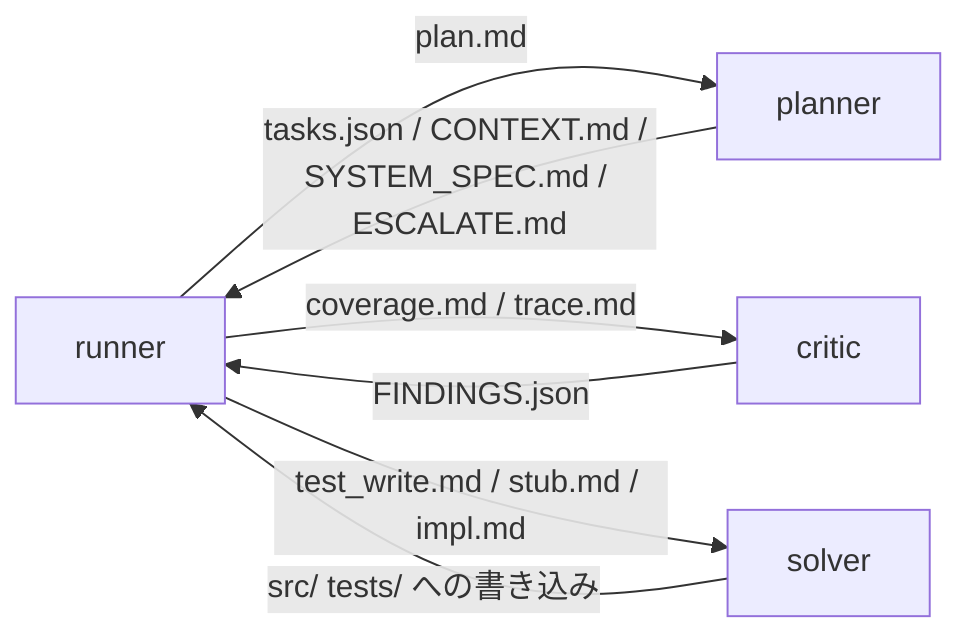

# AGENT_IO.md — 役どうしの受け渡し

プランナー、クリティック、ソルバーに何を渡し、何を受け取るかを述べる。上限値とブリーフの本文はコードにある。この文書は形と、どこで量が増えるかを示す。

## 受け渡しの形

役どうしが直接やりとりすることはない。受け渡しは、どれも次の順で進む。

1. ランナーがブリーフを1ファイルに組み立て、その役だけが読める場所に置く
2. 役の起動スクリプトが、ブリーフを `claude -p` の標準入力に流す
3. 役は作業場所にファイルを書く
4. ランナーがそのファイルを読み、確かめてから使う

呼び出しは毎回使い捨てになる。HOME を一時ディレクトリにし、`--no-session-persistence` で起動するので、前の呼び出しの記憶は残らない。1回の呼び出しの中では、エージェントが Read、Write、Edit を使って何ターンも回る。

| 役 | 起動 | ブリーフの置き場 | 書く場所 | ツール |
|---|---|---|---|---|
| planner | `planner-run` | `/srv/loop/planner/brief/plan.md` | `/srv/loop/planner/out/` | Read Write Edit |
| critic | `critic-run` | `/srv/loop/critic/brief/<mode>.md` | `/srv/loop/critic/out/` | Read Write |
| solver | `solver-run` → `solver-claude` | `/srv/loop/brief/<phase>.md` | `src/` と `tests/`（柵の場所） | Read Write Edit。Bash は禁止 |

ブリーフは呼び出しのたびに上書きする。置き場に残るのは、役とモードまたは位相ごとの最後の1回分になる。



## planner

| 場面 | 関数 | ブリーフの中身 |
|---|---|---|
| bootstrap | `brief_plan_bootstrap` | 要件、`environment_facts()`、`BOOTSTRAP_RULES`、`BOOTSTRAP_ESCALATE` |
| refine | `brief_plan_refine` | 要件、tasks.json の全文、critic の指摘の全文（上限の後は人が書き換えたもの） |
| 詰まった後の改訂 | `brief_plan_revise` | 計画より前からあるテストの名前（`preplan_tests_section`）、SYSTEM_SPEC.md、CONTEXT.md、tasks.json の全文、止まった理由、緑のステップ |

出力は `tasks.json`、`CONTEXT.md`、`SYSTEM_SPEC.md` の3つか、`ESCALATE.md` の1つ。ほかの名前のファイルは、ランナーが読まずに消す。

どの場面も `plan_with_retry` で包む。リンタに落ちると、違反の一覧をブリーフの末尾に足して呼び直す。呼び直しは最大 `LIMITS["revisions"]` 回。

## critic

`run_critique` が、モードごとに1回ずつ呼ぶ。

| モード | 関数 | ブリーフの中身 |
|---|---|---|
| coverage | `brief_critique_coverage` | 要件、tasks.json の全文、`environment_facts()` |
| trace | `brief_critique_trace` | tasks.json の全文、`environment_facts()`。要件は渡さない |

どちらのブリーフも `critic_material`（tasks.json の全文と `environment_facts()`）で始まり、役の説明、問い、要件はその後ろに置く。モードは続けて呼ぶので、2つ目の呼び出しは共通の部分をプロンプトキャッシュから読む。

出力は `FINDINGS.json` の1つ。ファイルが無いか読めなければ、ランナーは批評が起きなかったものとして止まる。指摘の `title` と `evidence` は日本語で書かせる。人が読んで書き換えるからだ。計画の条件や名前は、元の言語のまま引かせる。

`cmd_plan_refine` は、批評と planner の改訂を交互に回す。批評は最大 `LIMITS["critiques"] + 1` 周で、1周ごとにモードの数だけ critic を呼ぶ。周ごとの指摘は `human/in/CRITIQUE.json` に書く。

上限の周のあとも指摘が残れば、`CRITIQUE.json` を人が直せる状態（`waiting`）にして止まる。人は指摘の `title` と `evidence` だけを書き換えられる。消すことも足すこともできない。`plan refine --resume`（`resume_refine`）は、書き換えがあれば planner に1回だけ改訂させ、critic はもう呼ばない。書き換えた指摘には、refine のブリーフで `REWRITTEN BY THE HUMAN` の印が付く。書き換えが無ければ何もしない。

### environment_facts()

planner の bootstrap と critic の両方に入る。中身は次のとおり。

- 言語、ランタイム、テストランナーの版、画面の有無
- ランナーが流すテストのコマンド
- 根の直下と、柵の2つのディレクトリの中のファイル一覧
- 根にある環境のファイルの名前
- 既存のコードの公開宣言の署名（`existing_contracts`）。本体は渡さない
- 既存のテストのファイルとテストの名前（`existing_tests_text`）。planner には全部と差し替えの決まり、critic には計画が差し替えるファイルだけ
- テストが何に届くかを決めるファイル。C# はランナーが書く Tests.csproj の全文
- TypeScript なら `index.html` の全文

既存のコードが大きいプロジェクトでは、署名の一覧がブリーフの大半を占める。

## solver

`run_step` が、1ステップにつき次の順で呼ぶ。

1. TEST_WRITE（`brief_test_write`）: 共通の部分、受け入れ条件、書いてよいファイル、差し替える既存のテストファイル。goal は渡さない。テストがコンパイルできなければ、コンパイラの出力を足して最大 `LIMITS["test_writes"]` 回まで呼び直す
2. STUB: ランナーが契約からスタブを書く。書けないときだけ `brief_stub` で solver に頼む。渡すのは署名と書いてよいファイルだけ
3. IMPL（`brief_impl`）: 共通の部分、goal、凍結したテストの全文、書いてよいファイルの今の中身、このステップの前のコードとの差分、直前の失敗、書いてよいファイル。緑になるか試行を使い切るまで、ステップの試行の数だけ呼ぶ

TEST_WRITE と IMPL のブリーフは、同じ `solver_material`（CONTEXT.md、依存先の契約、不変条件、署名）で始まる。CONTEXT.md はステップをまたいで、残りは同じステップの位相をまたいで同じなので、後の呼び出しはそこをプロンプトキャッシュから読む。IMPL では、試行ごとに変わる今の中身と直前の失敗を後ろに置く。

solver は `plan/` を読めない。受け入れ条件はブリーフに書かれた分しか届かない。

IMPL のブリーフは、書いてよいファイルのうち作業ツリーにあるものの中身を、試行のたびに読み直して載せる（`current_files_section`）。合計が `IMPL_FILE_CHARS` を超える分は名前だけを挙げ、solver が自分で Read する。Claude Code の Edit と Write は、同じ呼び出しで Read していないファイルを拒むが、1行だけの Read でも通る。ブリーフはそれを solver に伝える。ほかの位相では、既存のファイルの中身はブリーフに入らない。

STUB は既存のメソッドの本体をスタブに差し替えるので、今の中身だけでは元の分岐が見えない。solver はそれを知らずに本体を一から書き、`else if` を1つ足せば済むところで分岐をまるごと差し替え、既存のものと同じ static のヘルパーを足していた。そこで、書いてよいファイルのうち最後のコミットにあったものは、今の中身との差分も載せる（`original_code_section`）。`-` の行が元のコードで、solver にはそれを土台に最小の変更をし、既存のヘルパーを呼ぶよう伝える。差分の合計も `IMPL_FILE_CHARS` を超えない分だけを載せる。

## 呼び出し回数

| 役 | 回数 |
|---|---|
| planner | bootstrap が 1〜(`revisions` + 1) 回。refine の1周ごとに同じだけ。改訂のたびに同じだけ |
| critic | (refine の周の数) × (モードの数) |
| solver | ステップごとに、TEST_WRITE 1〜`test_writes` 回、STUB 0〜1 回、IMPL 1〜(試行の数) 回 |

## 消費の記録

`run_agent` は呼び出しごとに `USAGE` を台帳（`plan/ledger.jsonl`）に書く。中身は `claude -p --output-format json` が返す `usage` の全体、`cost_usd`、`duration_ms`、`turns`、モデル。

画面とログには、同じ内容を1行で出す。

```text
[USAGE] who=solver phase=IMPL model=claude-sonnet-5 in=110 out=20 read=100 write=6 sec=4 usd=0.01
```

| 項目 | 中身 |
|---|---|
| `in` | 入力、キャッシュ読み取り、キャッシュ書き込みの和 |
| `out` | 出力 |
| `read` | キャッシュ読み取り（`cache_read_input_tokens`） |
| `write` | キャッシュ書き込み（`cache_creation_input_tokens`） |

種類ごとの読み方は次のとおり。

| 種類 | 何の量か |
|---|---|
| キャッシュ書き込み | 新しく渡した中身。ブリーフと、エージェントが読んだファイルの大きさ |
| キャッシュ読み取り | ターンの数 × そのターンまでの文脈の大きさ。Claude Code 自身のシステムプロンプトとツールの定義も毎ターン入る |
| 入力 | キャッシュに載らなかった端数 |
| 出力 | 思考と、書いたファイル |

ダッシュボードの「トークンの種類ごとの消費」は、この4種類を回ごとに積み上げて描く。

## 計測（2026/09/27、取り込んだ Unity のプロジェクトの回）

C# で10ステップを全部緑にした回の、台帳とブリーフの実測。

### ブリーフの大きさ

| ブリーフ | 字数 | 最大の節 |
|---|---|---|
| critic の coverage | 16.4万 | 既存の宣言 11.2万（68%）、計画 4.2万 |
| critic の trace | 16.5万 | 既存の宣言 11.2万（68%）、計画 4.2万 |
| planner の refine | 4.7万 | 計画 3.9万 |

### 役ごとの消費

台帳全体の値。この台帳には bootstrap の3回分が入っている。

| 役 | 呼び出し | ターン | 入力の合計 | うちキャッシュ読み取り | 出力 | USD |
|---|---|---|---|---|---|---|
| planner（Opus） | 9 | 49 | 350万 | 81% | 19万 | 9.73 |
| critic（Sonnet） | 12 | 24 | 264万 | 56% | 18万 | 6.75 |
| solver（Sonnet） | 21 | 94 | 298万 | 89% | 4万 | 2.26 |

### 読み取れること

- Claude Code 自身の固定費は1ターン約1.7万トークン。ブリーフが約8千の solver の呼び出しでも、2ターンで約5万になる
- critic は毎回2ターンで終わるが、1回約10万のキャッシュ書き込みを払う。大半は既存の宣言の一覧
- planner の bootstrap は約11万の文脈を抱えて7〜12ターン回り、1回で47万〜65万を読む
- solver の消費の63%は、既存のファイルを書き換える3ステップの IMPL だった。10〜23ターン回っている

## 更新履歴

- 2026/09/28: 役どうしの受け渡しと、2026/09/27 の回の計測を追加
- 2026/09/28: IMPL のブリーフに載せるファイルの今の中身を追加
- 2026/09/28: critic と solver のブリーフの共通の先頭を追加
- 2026/09/28: 既存のテストの名前と差し替えを追加
- 2026/09/30: IMPL のブリーフに載せるこのステップの前のコードとの差分を追加
