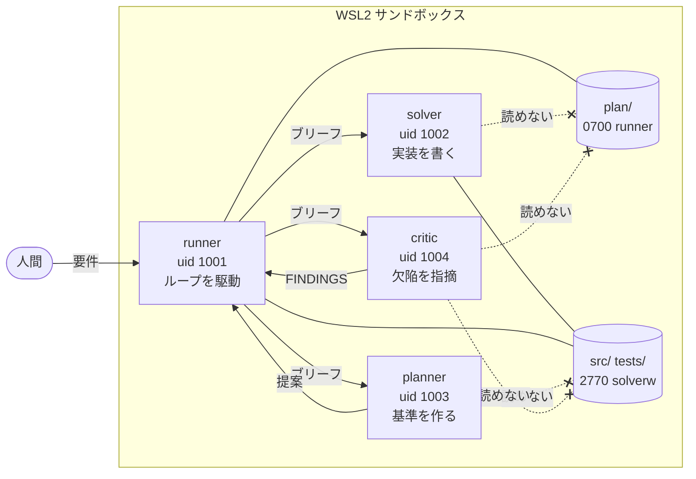
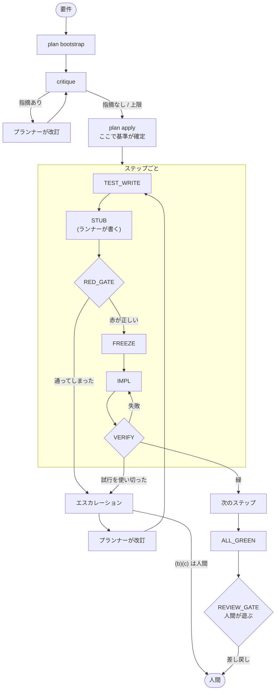

# ARCHITECTURE.md — この機械は何でできているか

`HANDOFF.md` は日誌、`RUNNER_SPEC.md` は規則の一覧です。この文書は**形**を述べます。

**書いてあるのは変わらないものだけ**です。上限値、ファイル一覧、リンタ規則の全文は
ここにありません ── 全部コードの中にあり、書き写せば必ずずれるからです
（同じ理由で `environment_facts()` は環境を読み取って渡します）。

---

## 1. 解こうとしている問題

AI に実装させると、**「テストが通りました」が自己申告になります。** テストを書いたのも
実装したのも同じ主体で、通らなければテストを緩められる。

この機械は、そこを**規律ではなく機構**で閉じます。

> **検知より剥奪。** `chmod 777` を監視するのではなく、`sudo` を取り上げる。

規則を守らせるのではなく、**破れる経路を無くす**。文書中で「守らせる」と書いてある
箇所は、ほぼ全て未完成の印です。

---

## 2. 四つの役

役は**プロンプトではなく uid** です。何を見られるかは、ファイルシステムが決めます。

| 役 | uid | 書けるもの | **見られないもの**（ここが本体） |
|---|---|---|---|
| **runner** | 1001 | 全部 | ── ループを駆動する。sudo は持たない |
| **planner** | 1003 | `planner/out/` の3ファイル | `src/` `tests/`（基準を作る者はコードに触れない） |
| **solver** | 1002 | `src/` `tests/`（凍結まで） | `plan/` `.git/`（受け入れ条件を読めない） |
| **critic** | 1004 | `critic/out/FINDINGS.json` | `plan/` `tests/` `src/` `planner/out/` |

runner は普通のプログラム（`runner/loop.py`）です。残りの3役は、それぞれの uid で
起動される Claude Code です。

| 役 | 起動スクリプト | 許すツール | 資格情報 |
|---|---|---|---|
| planner | `planner-run` | `Read` `Write` `Edit` | `/etc/loop/planner.env` |
| solver | `solver-run` → `solver-claude` | `Read` `Write` `Edit`。**`Bash` は禁止** | `/etc/loop/solver.env` |
| critic | `critic-run` | `Read` `Write` | `/etc/loop/critic.env` |

資格情報のファイルは、その役の uid だけが読めます。モデルと effort も同じファイルの
`LOOP_MODEL` と `LOOP_EFFORT` で役ごとに決めます。

**solver にコマンドを実行させないのは、テストを走らせる許可が、自分の書いたコードを
動かす許可と同じだからです。** 合否を出すのは runner の VERIFY だけです。
ソルバーのバックエンドは差し替えられます（`solver_tiers`。RUNNER_SPEC §4-4-1）。

**critic だけは「読めないこと」が役の価値そのもの**です。計画を読める critic は
「全基準を満たしている」と答え、テストを読める critic は「テストは通る」と答える ──
どちらも真で、どちらも無価値。だから無知を権限で作っています。



**破線が設計の本体です。** 基準を作る者はコードに触れられず、実装する者は基準を読めず、
批評する者はそのどちらも読めません。矢印は全部ランナーを経由します ──
役どうしが直接つながる線は1本もありません。

runner は sudo を持ちません。それでも他の uid でプロセスを起こせるのは、
`/etc/sudoers.d/` に**1役につき1スクリプトだけ**の例外があるからです ──
横移動であって昇格ではありません（どの役も自前の権限を持たないので、継ぐものが無い）。

検査は `provision/40-perms.sh` と `45-agent-invoke.sh` が**その役の視点で**行います。
**試していない権限モデルは、存在しないのと同じ**です。実際、critic 用に書いた検査が
初回で既存の穴を見つけました（`tests/` が誰でも読めていた）。

---

## 3. 位相 ── どの関門が何を訊いているか

```
PLAN_LOAD → TEST_WRITE → STUB → RED_GATE → FREEZE → IMPL ⇄ VERIFY → GREEN
```



**外側の輪**（`critique` → 改訂 → `critique`）は `plan apply` の**前**で回ります ──
そこが「基準がまだ草案である最後の瞬間」だからです。
**内側の輪**（IMPL ⇄ VERIFY）はステップの中で回ります。
**破線のない出口**は人間だけ ── (b) 基準の書き換えと (c) 上流からの作り直し、
そして承認です。

| 関門 | 訊いていること | 潰している不正 |
|---|---|---|
| リンタ | この計画は**検査可能な形**か | 走らせてから判明する破綻 |
| TEST_WRITE | 実装より**先に**テストが在るか | 後付けテスト |
| STUB | 形だけあって値が全部間違っているか | ── **ランナーが書く**（§5） |
| RED_GATE | そのテストは**落ちうることを示したか** | 自明なテスト、通らない基準 |
| FREEZE | テストは以後**書き換え不能**か | 実装に合わせたテスト修正 |
| VERIFY | 通ったか。**通っていたものが落ちていないか** | 前のステップの破壊 |

**RED_GATE の R5 が本体**です。「落ちた」では足りず、**落ち方**を見ます ──
`AssertionError` は赤と認め、`TypeError` や `ImportError` は認めない。これで赤の意味が
「まだ実装が無い」から「**呼び出しは全部成立していて、値だけが違う**」に変わります。

**VERIFY は2つの半分**でできています。「このステップのテストが通る」と
「**通っていたテストが1つも落ちない**」。当初は前半しか見ておらず、あるステップが
前のステップを壊してもランナーは緑と呼んでいました ── 検知していたのではなく、
たまたま壊れていなかっただけです。

---

## 4. 三つの輪

```
内輪    IMPL ⇄ VERIFY、詰まれば計画を改訂して再試行        ✅ 回る
外輪    計画 → critique → 計画の改訂 → 実装                ✅ 回る（2026-09-21）
最外輪  engine の欠陥 → engine が直る                      ❌ 人間
```

**外輪が最後に閉じました。** `plan refine` が critic の指摘をプランナーへ戻し、
指摘が尽きるか上限に達するまで繰り返します。**`plan apply` の前に回る**のが要点で、
そこが「基準がまだ草案である最後の瞬間」だからです ── 適用後の基準変更は
人間の判断（RUNNER_SPEC 6-2）になります。

critic は2つのモードを持ちます。run 7 の計画で試したとき、**見つけたものが
一つも重なりませんでした**。

| モード | 渡すもの | 見つけるもの |
|---|---|---|
| `coverage` | 要件 + 計画 | 要件のうち、どの基準も守っていないもの |
| `trace` | **計画のみ** | 初期状態から到達できる状態。不動点、死んだコード |

`trace` に要件を渡さないのはテストで固定しています。run 7 の要件は初期状態に
一言も触れていなかったのに、trace は**計画だけから**「このゲームは1クリックも
受け付けない」を導きました ── **要件の書き漏れを補えるのはそのため**です。

**critic は承認できません。** 指摘ゼロは「止めなかった」だけで、何も緑にしません。
緑は関門が決め、良し悪しは人間が決めます。

---

## 5. ランナーが自分で書くもの

**判断が要らない仕事は機械がやります。** モデルに頼むのは、頼むこと自体が
費用と分散を生むからです。

**スタブ。** 「形は正しく、値は全部間違っている」を作るのに判断は要りません。
契約（`contracts.provides`）が署名も型の中身も置き場も持っており、L14 と L15 は
それを保証するために在ります。8回の run のあいだソルバーに書かせていましたが、
run 8 の S1 は**正解を返すスタブ**で4回止まりました ── `return false`、そして
`return {resource: 0, generators: {}, lastUpdate: 0}`。ブリーフは「既定値を返すな」と
明示しています。届いて、読めて、無視されました。

**モデルが無視できる指示より、届かない規則のほうが強い。**

boolean だけは例外です。**どの boolean も何かの正解**なので「正しい型の間違った値」が
存在しません。そこだけ異物（`"__stub__" as unknown as boolean`）を返します。

---

## 6. 繰り返し出てくる失敗の形

規則の一つ一つに run が1本ずつ紐づいています。**設計文書としての価値はここにあります。**

### 書いていないことは伝わらない

| | |
|---|---|
| L15 | 契約がモジュール名を言わず、ソルバーが import 先を推測して収集に失敗（run 4） |
| 欠陥4 | 「`python -m idlegame` で開く」を検証する基準が1つも無かった（run 7） |
| S10 | プランナーが直し方を `goal` に900字書いた。テストは `acceptance` から起こすので届かなかった（run 7） |

### 機械が自分について嘘をついていた

run 8 の S1 は13回止まり、**12回がこれ**でした。

| | |
|---|---|
| システムプロンプト | TypeScript の契約を渡しながら「You write Python files.」と言っていた |
| 出力予約 | 窓の半分を予約。返答は十分の一。入るはずのブリーフを拒否していた |
| エラーの可読性 | vitest の色コードで1文字ずつ分解された文字列を「直せ」と渡していた |
| 失敗の報告 | `expected +0 to be 7` を一度も渡さず、6回外させた |

**どれも外からは「出来の悪いモデル」に見えます。** `solver-local` のコメントが
最初からそう書いていました ── 「外からは、単に出来の悪いモデルと区別がつかない」。

### Python の文法が普遍的な規則の顔をしていた

L14 の語彙、L15 の名前境界、L3 の名前抽出、契約の書式、`plan apply` の言語判定、
システムプロンプト ── **6回**。規則が間違っていたのではなく、**その表現が**
一つの言語に縛られていました。

---

## 7. 人間にしかできないこと

| | 誰が | なぜ |
|---|---|---|
| 要件を書く | 人間 | 何を作るかは機械の管轄外 |
| 基準の書き換え（case b） | 人間 | 測られる対象そのものを変える行為 |
| 上流からの作り直し（case c） | 人間 | 緑を捨てる判断 |
| 予定レビューの**承認** | 人間 | 機械には画面が見えない。**差し戻しは誰でもできる** |

最後の非対称が重要です。**「駄目だ」は安く、「良い」は高い。** ダッシュボードも
同じ形で、リモートからは差し戻せますが承認はできません ── 画面を開けない端末が
「遊べた」と記録できてしまったら、関門そのものが無意味になります。

---

## 8. まだ閉じていないもの

| | |
|---|---|
| **最外輪** | engine の欠陥は人間が見つけて人間が直す。台帳を run 横断で読む者がいない |
| **REVIEW_GATE** | v1 で未実装。基準→テストの翻訳を検査する唯一の関門 |
| **位相単位の再実行** | IMPL で落ちても TEST_WRITE から全部やり直す。通ったテストも捨てる |
| **エスカレーションの帰責** | 機械が原因でも「計画が失敗した」としか記録されない |

REVIEW_GATE の不在は run 8 で3回顕在化しました ── 期待値リテラルの括弧落ち、
存在しないマッチャ、モックが `""` を `null` に潰す。**3件とも凍結されるので
後から誰にも直せません。**

---

## 読む順番

1. この文書 ── 形
2. [BOOTSTRAP.md](BOOTSTRAP.md) ── 設計思想とプランナー向けの手順
3. [RUNNER_SPEC.md](RUNNER_SPEC.md) ── 関門の判定条件とリンタ規則
4. [HANDOFF.md](HANDOFF.md) ── 現在地と再開点
5. [provision/README.md](../provision/README.md) ── 箱の作り方と落とし穴

## 更新履歴

- 2026/09/26: 3役の実体（Claude Code）、許すツール、資格情報の置き場を §2 に追加
